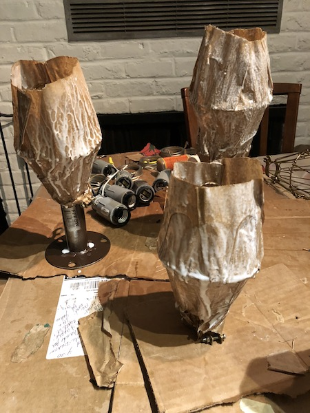
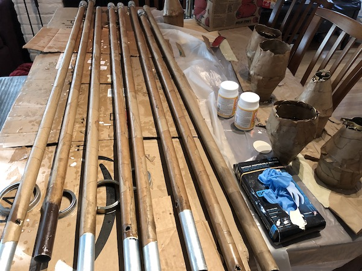
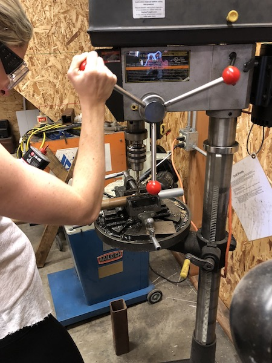
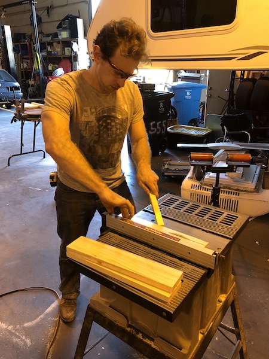
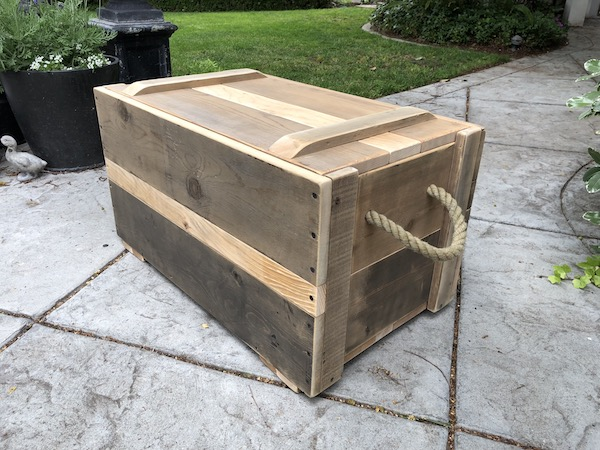

# About us

We're a group of seasoned Burning Man explorers who are dedicated to inspiring wanderers -- both newly embarking on explorations and those jaded by years of experience -- to discover parts of our fair city which are sometimes overlooked.

Our camp is styled as an old-world explorer encampment, filled with eclectic trickets, comfortable places to lounge and soft lights and sounds in the evenings. It's the perfect place to sip on some tea or brandy and figure out where your next adventure will take you.

Through our adventure bar and novel events we host, our aim to increase randomness and spontaneity into how people experience Burning Man.

# Events

## Chap Challenges & Championship - Everyday, 3pm

Challenges will occur every day for each of the events with the Grand Championship being held on Friday afternoon. Events will be as follows:

 * **Tea-lay** – A game inspired by the relay. Contestants will run around a course, transferring a cup of tea from one contestant to the next. The amount of tea remaining in each team’s cup will decide the winner.
 * **Umbrella Jousting** – Mount your bicycles and engage in noble battle, wielding umbrellas instead of jousts, with owler hats and briefcases in place of traditional armor.
 * **Not Tennis** – On a fully kitted court, contestants will attempt to outdo each other in NOT playing tennis as well as they know how. Points will be awarded for creativity in not playing.
 * **Bar Backing** – A fleet of bartenders mix a perfect cocktail at the bar. When the bell is rung, contestants must make a three-legged dash to the bar. If they don’t make it in the time limit, the bartender gets to drink their drink.
 * **Most hats worn while riding a bike** – We will attempt to set a world record for most hats worn while riding a bicycle. The current world record is 28 hats.

All challenges will be followed by a genteel teatime.

## Brandy & Tea Adventure Bar Happy Hour - Tuesday, Thursday 2pm-5pm

The adventure bartenders will be well-versed in the events and happenings from across the playa Over a cup of brandy or tea, our bartenders will engage with the attendees and listen to their stories. After a time, the bartender will gauge their personality and predilections and develop a bespoke adventure plan. We will tell them when and where to show up, but not what they're doing, to preserve the immediacy of the experience.

## Dessert Bar - Monday 11am-2pm

What speaks to the hedonist and the grammarian in all of us? That's right. New Dessert at the New Desert Outpost! Come by our camp for fresh baked Desserts from our New Desert Dessert oven and satisfy your craving for both puns and cookies.

## Pockets - Wednesday, 12pm-2pm

In the spirit of adventuring, we want to help our fellow Burners adapt their clothing to add utility. This opens up realms of creativity that some might not have anticipated - you can add pockets to clothes you love but that are impractical (especially women’s clothing!), add customized pockets for your favorite everyday objects, make decorative pockets that express your personal flare, or utilitarian ones that help keep your hands free.
We'll provide sewing needles, thread, fabric to make pockets from, and our expertise to help add patch pockets, bellows pockets, and side-seam pockets to whatever garments we can.

## Droga - Thursday at 5pm

A person who knows something about yoga, but more about drinking. A person who can channel the most secret cocktail Chakra and bring peace and tequila to your parched and tired soul. This is the guru with whom you will learn, at Droga.
This blessed individual will guide you through a routine comfortable for both beginners and the most enlightened yogi, all the while offering what can only be described as truly transcendent plastic handle liquor. You may learn, but you will definitely drink, and you will wobble from our tent at peace with your decisions.

# Camp Design

Inside the tent will be a comfortable old-world inspired lounge and bar, filled with eclectic items, fun trinkets and soft lighting. It's the perfect place to find refuge from the intense sound and lights in the evening, while you figure out where your next adventure will take you.

# Building & Crafting

## Beryl

Our lovely, old-timey, burn barrel.

## Building electric torches

These rugged torches flicker as if they are really burning and provide a wild and inviting entrance to our camp.

## Wooden crates

They store our stuff while providing a fun antique feeling to the camp.

