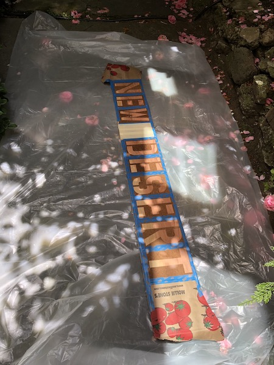
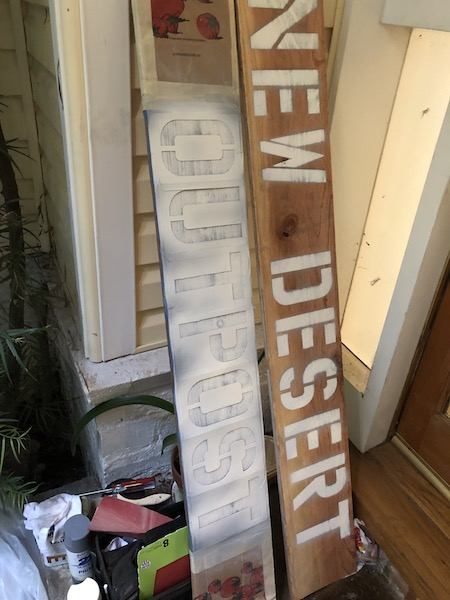

# About us

We're a group of seasoned Burning Man explorers who are dedicated to inspiring wanderers -- both newly embarking on explorations and those jaded by years of experience -- to discover parts of our fair city which are sometimes overlooked.

Our camp is an old-world inspired explorer encampment, filled with eclectic trinkets, comfortable places to lounge and soft lights and sounds in the evenings. It’s the perfect place to sip on some tea or brandy and figure out where your next adventure will take you.

Through our adventure bar and novel events we host, our aim to increase randomness and spontaneity into how people experience Burning Man.

# Find Us

Burning Man 2018: 4:15 and Iron Giant

Facebook Page: [https://www.facebook.com/New-Desert-Outpost-239932759997292/](https://www.facebook.com/New-Desert-Outpost-239932759997292/)

# Events

## Chap Challenges & Championship
### Everyday, 3pm

Challenges will occur every day for each of the events with the Grand Championship being held on Friday afternoon. Events will be as follows:

 * **Tea-lay** – *A test of speed and agility.* - Teams of four chaps run four laps, one each, while passing between them a full cup of tea. The fastest time to complete four laps without spilling more than 1/3 of the cup of tea wins.
 * **Umbrella Jousting** – *A test of strength.* - Two chaps on bicycles attempt to knock the hats off each others’ heads using only a single umbrella as a weapon, and a briefcase as a shield.
 * **Not Playing Tennis** – *A test of procrastination.* - Using the equipment provided, chaps endeavour to avoid playing a game of tennis by any means available; points are awarded for both difficulty and execution.
 * **Hat tower** – *A test of coordination.* Individual chaps balance as many hats on their heads while riding their bicycle from one (corner of camp) to the other. The highest number of hats that complete the journey wins.

This is all leading up to the championship on Friday!

## Afternoon Tea
### Tuesday 2pm

[https://www.facebook.com/events/384735268718128/](https://www.facebook.com/events/384735268718128/)

Right, oh, good fancy person! Come sip and share the same splendiforous sweetness that soothes the serene. New Desert Outpost will be serving (and maybe spilling) teas from the Spanish seas to the Caribbean keys with soberings, yet smashing stories. Bring your liquid containers!

## Happy Hour - Brandy & Adventure Bar
### Thursday 2pm

[https://www.facebook.com/events/199755594043192/](https://www.facebook.com/events/199755594043192/)

The adventure bartenders will be well-versed in the events and happenings from across the playa Over a cup of brandy or tea, our bartenders will engage with the attendees and listen to their stories. After a time, the bartender will gauge their personality and predilections and develop a bespoke adventure plan. We will tell them when and where to show up, but not what they're doing, to preserve the immediacy of the experience.

## Dessert Bar
### Monday 11am

[https://www.facebook.com/events/225444528089903/](https://www.facebook.com/events/225444528089903/)

What speaks to the hedonist and the grammarian in all of us? That's right. New Dessert at the New Desert Outpost! Come by our camp for fresh baked Desserts from our New Desert Dessert oven and satisfy your craving for both puns and cookies.

## Pockets
### Wednesday 12pm

In the spirit of adventuring, we want to help our fellow Burners adapt their clothing to add utility. This opens up realms of creativity that some might not have anticipated - you can add pockets to clothes you love but that are impractical (especially women’s clothing!), add customized pockets for your favorite everyday objects, make decorative pockets that express your personal flare, or utilitarian ones that help keep your hands free.
We'll provide sewing needles, thread, fabric to make pockets from, and our expertise to help add patch pockets, bellows pockets, and side-seam pockets to whatever garments we can.

## Chap Championship
## Friday at 3pm

[https://www.facebook.com/events/253871225445226/](https://www.facebook.com/events/253871225445226/)

The ultimate throw down of chappitude, the Chap Championships!

Are you refined but idle? Are you an expert hat wearer? Does your swagger require careful calibration so as not to upset your tea? Do you demur with such panache that your hosts feel lucky to have been turned down by you?

## Droga
### Saturday at 1pm

[https://www.facebook.com/events/212222592958947/](https://www.facebook.com/events/212222592958947/)

A person who knows something about yoga, but more about drinking. A person who can channel the most secret cocktail Chakra and bring peace and tequila to your parched and tired soul. This is the guru with whom you will learn, at Droga.
This blessed individual will guide you through a routine comfortable for both beginners and the most enlightened yogi, all the while offering what can only be described as truly transcendent plastic handle liquor. You may learn, but you will definitely drink, and you will wobble from our tent at peace with your decisions.

# Camp Design

Inside the tent will be a comfortable old-world inspired lounge and bar, filled with eclectic items, fun trinkets and soft lighting. It's the perfect place to find refuge from the intense sound and lights in the evening, while you figure out where your next adventure will take you.

# Building & Crafting

## Sign

When you see this, you know you're here.

## Beryl

Our lovely, old-timey, burn barrel.

## Electric torches

These rugged torches flicker as if they are really burning and provide a wild and inviting entrance to our camp.

## Wooden crates

They store our stuff while providing a fun antique feeling to the camp.

